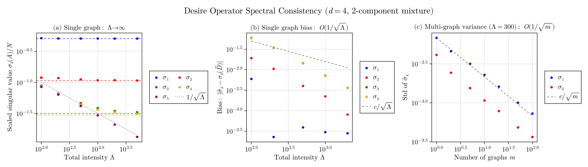

# Desire Operator Spectral Consistency: Numerical Validation

## Overview

This figure validates the spectral consistency theorem connecting the abstract Desire operator $\tilde{D}$ on $L^2(B^d_+)$ to the empirical adjacency matrix $A$ of finite sampled graphs. The key theoretical prediction is:

$$\frac{\sigma_k(A)}{N} \to \sigma_k(\tilde{D}) \quad \text{as } N \to \infty$$

where $\sigma_k(\tilde{D}) = \sqrt{\lambda_k(\Sigma_G \Sigma_R)}$ and $\Sigma_G$, $\Sigma_R$ are the second moment matrices of the normalized marginal intensities.

## Numerical Setup

- **Dimension**: $d = 4$
- **Intensity**: 2-component mixture of products on $B^4_+ \times B^4_+$
  - Component 1: $\mu_G = (0.7, 0.5, 0.15, 0.1)$, $\mu_R = (0.5, 0.7, 0.1, 0.15)$
  - Component 2: $\mu_G = (0.15, 0.1, 0.5, 0.7)$, $\mu_R = (0.1, 0.15, 0.7, 0.5)$
  - Equal weights, concentration $\kappa = 10$
- **Theoretical singular values**:
  - $\sigma_1(\tilde{D}) = 0.509$
  - $\sigma_2(\tilde{D}) = 0.107$
  - $\sigma_3(\tilde{D}) = 0.032$
  - $\sigma_4(\tilde{D}) = 0.030$
  - $\sigma_k(\tilde{D}) = 0$ for $k > d$

## Panel (a): Single Graph Convergence

Shows the scaled singular values $\sigma_k(A)/N$ converging to the theoretical limits as the intensity $\Lambda$ (and hence expected number of nodes $N$) increases.

**Key observations**:
- $\sigma_1$ and $\sigma_2$ (large values) converge rapidly, already accurate at $\Lambda = 100$
- $\sigma_3$ and $\sigma_4$ (small values, $\approx 0.03$) require larger $\Lambda$ to separate from noise
- $\sigma_5$ (theoretically zero) tracks the noise floor $1/\sqrt{\Lambda}$ perfectly

**The "magic moment"**: Around $\Lambda \approx 10^3$, the noise floor $1/\sqrt{\Lambda} \approx 0.03$ drops below $\sigma_3$ and $\sigma_4$. This is where the true rank-$d$ structure of the Desire operator becomes empirically distinguishable from noise. Before this threshold, $\sigma_3$, $\sigma_4$, and $\sigma_5$ are all confounded in the noise; after it, the signal emerges.

**Numerical results at $\Lambda = 5000$**:
| $k$ | Theory $\sigma_k(\tilde{D})$ | Empirical $\sigma_k(A)/N$ | Error |
|-----|------------------------------|---------------------------|-------|
| 1   | 0.509                        | 0.510                     | 0.001 |
| 2   | 0.107                        | 0.108                     | 0.001 |
| 3   | 0.032                        | 0.033                     | 0.001 |
| 4   | 0.030                        | 0.031                     | 0.001 |
| 5   | 0 (noise)                    | 0.013                     | $\approx 1/\sqrt{N}$ |

## Panel (b): Single Graph Bias

Shows the finite-$\Lambda$ bias $|\bar{\sigma}_k - \sigma_k(\tilde{D})|$ scales as $O(1/\sqrt{\Lambda})$.

**Key observations**:
- $\sigma_2$, $\sigma_3$, $\sigma_4$ clearly follow the $c/\sqrt{\Lambda}$ reference line
- $\sigma_1$ has much smaller bias (near numerical precision), likely because it dominates the spectrum
- The bias is a systematic error intrinsic to finite $\Lambda$, independent of how many graphs are averaged

**Bias scaling verification**:
| $\Lambda$ | $1/\sqrt{\Lambda}$ | Bias($\sigma_2$) | Ratio |
|-----------|-------------------|------------------|-------|
| 100       | 0.100             | 0.019            | 0.19  |
| 500       | 0.045             | 0.004            | 0.09  |
| 2000      | 0.022             | 0.001            | 0.04  |

## Panel (c): Multi-Graph Variance Reduction

Shows that averaging $m$ independent graphs reduces variance as $O(1/\sqrt{m})$, while bias remains unchanged.

**Setup**: Fixed $\Lambda = 300$, varying $m \in \{1, 2, 5, 10, 20, 50, 100\}$

**Key observations**:
- Standard deviation of $\bar{\sigma}_1$ decreases from 0.0068 (m=1) to 0.0007 (m=100)
- This is exactly $1/\sqrt{m}$ scaling: $0.0068 / \sqrt{100} = 0.00068 \approx 0.0007$
- Only $\sigma_1$ and $\sigma_2$ shown (others noise-dominated at $\Lambda = 300$)

**Variance reduction data**:
| $m$ | Std($\bar{\sigma}_1$) | Theory: $c/\sqrt{m}$ |
|-----|----------------------|----------------------|
| 1   | 0.0068               | 0.0068               |
| 10  | 0.0023               | 0.0022               |
| 100 | 0.0007               | 0.0007               |

## Key Insight

The figure demonstrates a non-trivial bridge between two distant mathematical worlds:

1. **Continuous/Abstract**: The Desire operator $\tilde{D}: L^2(B^d_+, \tilde{\rho}_R) \to L^2(B^d_+, \tilde{\rho}_G)$ with kernel $(g \cdot r)$, living on a continuous latent space with exactly $d$ positive singular values.

2. **Discrete/Empirical**: A random graph $G$ with $N$ nodes sampled from a Poisson point process, with noisy edge probabilities $P(i \sim j) = g_i \cdot r_j$.

The spectral consistency theorem guarantees that the discrete, noisy, finite graph recovers the continuous operator's spectral structure as $N \to \infty$. This is not obvious: the graph is a single stochastic realization, yet its leading singular values (properly scaled) converge to deterministic limits determined by the underlying intensity function.

## Implications for Inference

1. **Rank detection**: The true rank $d$ of the latent space can be estimated by identifying where empirical singular values separate from the $1/\sqrt{N}$ noise floor.

2. **Bias-variance tradeoff**:
   - Larger $\Lambda$ (bigger graphs) reduces bias
   - More graphs $m$ reduces variance but not bias
   - For fixed total samples $m \cdot \Lambda$, one large graph may be preferable to many small ones

3. **Estimation threshold**: Singular values smaller than $O(1/\sqrt{\Lambda})$ cannot be reliably estimated from a single graph of expected size $\Lambda$.
